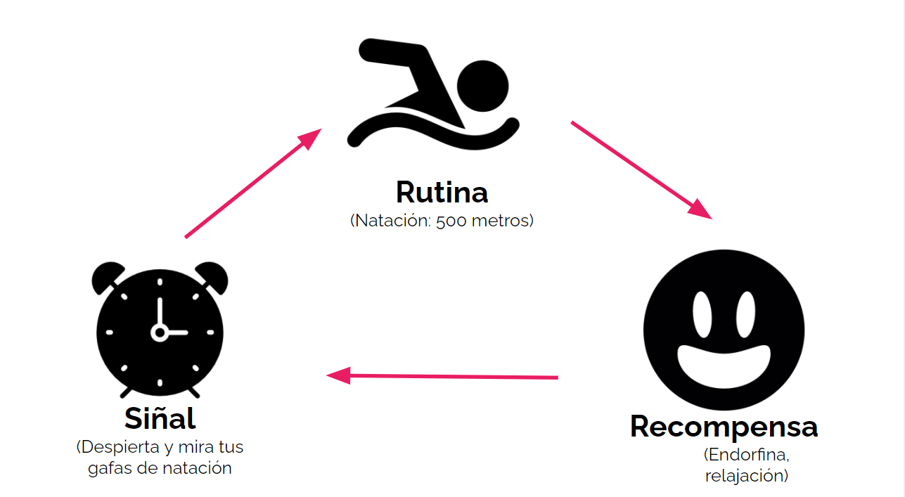
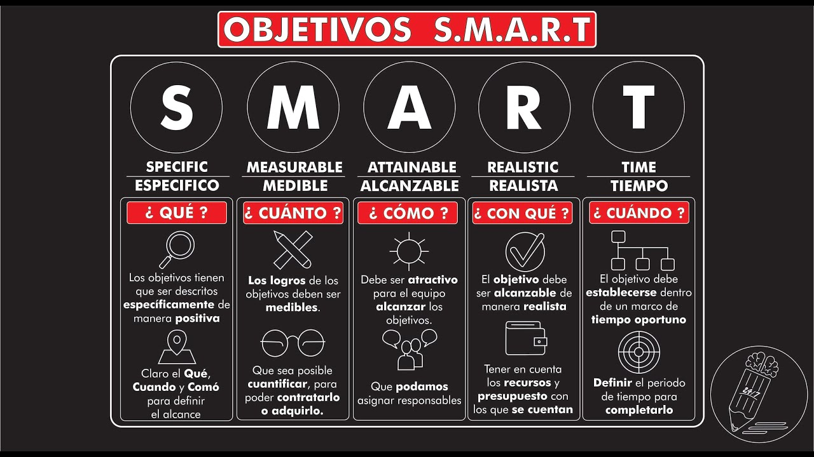
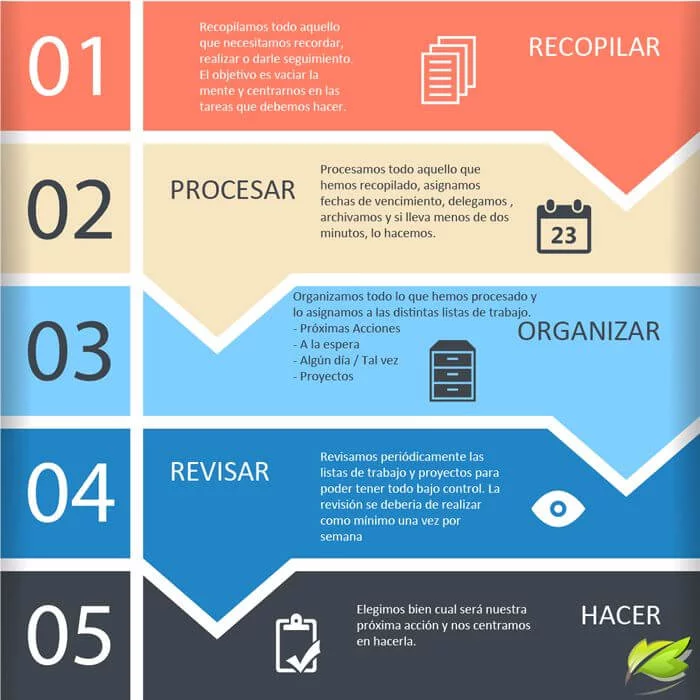

# Hábitos
##  Objetivos y metas
Trabajando con listas (como la de éxito)
Dos principios:
1. objetivo claro alcanzable
2. Metas ---> mas cortas que el objetivo, pero a corto plazo me mantienen enfocado 

### Resoluciones de año nuevo
 ¿Qué hacer para ser más efectivo en relación con sus hábitos?
* Hacer una lista de los objetivos y revisarla constantemente.
* Anotar los objetivos y sus respectivas metas.

## Acción
Suponiendo que un objetivo está relacionado con algo que se espera lograr y las metas son las acciones que se deben 
tomar para lograr el objetivo, 
**haz tu lista de objetivos (al menos 3) y de las respectivas metas para lograr esos objetivos.**

### El Loop del hábito
El poder del hábito -. Charles Duhigg

3 componentes

1. cue o la señal (como un click para empezar "el ejemplo fue prender la pc o tomar su café")
2. rutina 
3. Recompensa 

Otro ejemplo: para leer mas, 
1. libro en la cabecera de la cama ese sería el `Cue`.
2. la `rutina` leer un capítulo todas las noches.
3. Como `recompensa` "mejor sueño y un dia de lectura ganado".

"Los hábitos son secuencias de acciones aprendidas después de muchas repeticiones hasta que comienzan a realizarse con
un mínimo de esfuerzo mental." -. Wolfram Shultz

Vimos que el Hábito Loop tiene tres componentes: l*a Señal*, _la Rutina_ y _la Recompensa_.
Si tuvieras que explicarle a alguien qué es la señal, ¿cuál de las siguientes alternativas serían las correctas?

* La señal significa recordar que hay que hacer algo.
* La señal es aquello que nos hace comenzar una acción.

### Objetivos más específicos
Los `plazos` son importantes también para que los hábitos se formen y trabajen a nuestro favor.

### Tu meta SMART
Ahora es tu turno de usar la Meta SMART. Después de establecer una meta, piensa en los 5 elementos que hacen una meta 
SMART y cómo puedes ajustarlos para que se cumpla.

Solo para recordar, una meta SMART debe ser: específica, medible, alcanzable, relevante y tener una fecha límite.

### En esta clase aprendimos:
* Que hay una diferencia entre objetivos y metas.
* El objetivo es la descripción de lo que quieres lograr.
* La meta es la definición en términos cuantitativos y con un término fijo.
* El ciclo del hábito siempre comienza con una señal, un disparador que transfiere tu cerebro a un modo que determina 
automáticamente qué hábito usar.
* Cuando te pones objetivos, es esencial que te motiven: significa asegurarte de que son importantes para ti y de que 
hay valor en alcanzarlos.

## Hábitos Clave
### Cambio de hábitos
¿Es fácil crear nuevos hábitos?
**Dr. Maxwell Maltz** Hizo un estudio, y él percibió que la gente al menos necesitaba de 21 días para formar un nuevo
hábito (pero como mínimo) quiere decir que puede tardar mas y aún ser posible.

El número mágico es un MITO.

* _A la gente le gustan los números mágicos y 21 parecía un tiempo razonablemente corto para crear nuevos hábitos._
* La gente no se dio cuenta cuando el Dr. Maltz dijo que tomó al menos 21 días.

Phillipa Lally Psicóloga: Según su estudio la media es de 66 dias para formar un nuevo hábito.

**Construir un nuevo hábito no es un proceso de todo o nada.** Es importante también tener flexibilidad

### Adquisición de nuevo hábito
Puede variar según:
* La persona.
* La circunstancia.
* El comportamiento.

**Después de hacer una lista con tus metas y objetivos, podrás crear un nuevo hábito a través del Loop del hábito.**

**Teniendo un hábito clave, me doy cuenta de que otras áreas de mi vida pueden mejorar.**

### En esta clase aprendimos:
* Que los hábitos clave son capaces de desencadenar una serie de reacciones en la forma en que las personas organizan
sus propias vidas.
* Con base en los malos hábitos, evaluar qué acciones nos conducen a ellos. Algunos postergadores, por ejemplo, 
retrasan el inicio de sus actividades porque piensan que son aburridas o que son imposibles de ejecutar.
* Es posible, por ejemplo, dedicar las primeras horas de trabajo a la organización del día, es decir, establecer 
todo lo que deberá hacerse y la hora para cada tarea.
* Crear un hábito, es un camino, a veces habrá progreso, estancamiento o incluso retroceso. Por esta razón, no se 
recomienda generarnos altas expectativas o exigirnos altos rendimientos desde el principio.
* Es posible establecer hábitos para cada una de las actitudes que son perjudiciales para la productividad y la 
atención de un profesional. En el transcurso, podrán cometerse errores y se podrá comenzar nuevamente, tantas veces 
como sea necesario, pero siempre revisando el progreso

## Adios viejos Hábitos
### Dilación
La dilación nada más es algo que nos impide hacer algo importante o urgente. Es un enemigo que tenemos que combatir, 
porque si no, nuestros hábitos no van a mejorar.

Para mejorar necesitamos tener en claro dos cosas: los **hábitos** y mantener la **organización**.

_Procrastinar es normal y si quieres aprender a ser más productivo, invierte en la organización. Podrás comprender dónde 
pierdes el tiempo y podrás pensar en nuevos hábitos para evitar este tipo de comportamiento._

Recuerda que puedes usar Evernote, Todoist, calendario en papel o cualquier otro recurso que te resulte útil.

* Además de colocar las tareas en detalle, incluye la lista de verificación y los plazos para tener una referencia sobre
las fechas de entrega.

### Recompensas

Las recompensas son fundamentales para ayudarnos a mantener nuestra automotivación siempre alta.

Ejemplo de recompensa (age of empires II) luego de estudiar muchas horas.

_Cuando creamos un nuevo hábito, la recompensa puede motivarnos a mantenerlo._ 

¿Has pensado en las recompensas que quieres experimentar?

* Juega tu juego favorito.
* Practica tu deporte favorito.
* Mira algo que te haga reír.
* Pasa tiempo con familiares / amigos.
* Relájate.
* Lee un libro diferente.

### En esta clase aprendimos:
* Que es posible combatir la dilación.
* Enumerar las tareas diarias.
* Dividir el trabajo en tareas más pequeñas y tomar descansos. 
* Crear un ambiente de trabajo favorable.
* Establecer recompensas para mantenerse motivado.

## Autodisciplina
### Organización
El olvido se puede deber a muchas cosas:
* Estres 
* Distracciones
* Ansiedad

Organizado no solo significa ordenado, sino por ejemplo saber donde está la información que buscamos rápidamente.

ejemplos para organizar: trello, todoist, evernote 

_Vimos que la disciplina es la capacidad de mantenerse enfocado en las tareas necesarias para lograr un objetivo sin 
desviarse ni perder la motivación._

### Estilo de vida
También hablamos sobre el estilo de vida, es decir, cómo nos comportamos, cuáles son nuestros hábitos y nuestra forma 
de vida. Ahora tómate el tiempo para reflexionar sobre las siguientes preguntas:

* ¿Estás satisfecho con tu estilo de vida?
* ¿Qué te gustaría mejorar?
* ¿Cómo piensas lograrlo?

Recuerda que crear metas para tus objetivos puede ayudarte a sacar planes del campo de ideas y hacerlos realidad.

### Personas exitosas
Otra reflexión importante hecha en este video fue sobre lo que significa tener éxito. Esto puede variar de persona a persona. 
Tener una carrera estable, estar en constante aprendizaje, tener las finanzas actualizadas y esforzarse por superar las
expectativas al entregar todo lo que se hace con calidad, puede ser uno de los criterios que indica cuándo una persona 
va a tener éxito.

### Vida personal y profesional
Buscar equilibrio En mi caso al no gustarme mi trabajo no me hace feliz.
### En esta clase aprendimos:
* La importancia de desarrollar la autodisciplina.
* La importancia de no perder el enfoque de lo que se tiene que hacer.
* Mantener tu organización al día.
* Que la autodisciplina es una habilidad que abre puertas para que se desarrollen otras habilidades importantes para 
la carrera profesional.

## Productividad
### Técnica Pomodoro
La técnica Pomodoro, creada Francesco Cirillo en Italia a finales de los años 80.

Una de las formas de utilizarla es crear primero la lista de tareas para contabilizar y medir el desempeño.

**¡Importante gestionar las distracciones!!!** Por ejemplo ante una interrupción si es importante anotarlo para después.

_La Técnica Pomodoro te puede ayudar a enfocarte y evitar la procrastinación, sin embargo, evita llegar al extremo de 
convertirte en una persona antisocial._

### Get Things Done
Cuando nos vemos en una situación donde estamos muy cansados, la sugerencia es que practique la metodología
GTD, que es Getting Things Done, o sea, el arte de hacer las cosas realidad.

Se trata de un sistema de productividad y administración del tiempo que ayuda a completar tareas y gestionarlas, así 
como a cumplir compromisos de una forma eficiente y sin estrés mediante un sistema integral de listas y calendarios.

**Tu mente fue creada para tener ideas, no para almacenarlas.**
Esto quiere decir, ante muchos estímulos y tareas anotar las cosas para no olvidarlas.

https://asana.com/es/resources/getting-things-done-gtd

### En esta clase aprendimos:
* Que utilizando el método Pomodoro es posible conocer no solo la cantidad de actividades que se realizan, sino también
la calidad.
* Además, es posible medir aquello que dificulta el cumplimiento de las tareas.
* El método también es útil para personas ansiosas, porque se les dificulta organizar sus actividades.
* Para usar este método necesitarás: un temporizador o reloj despertador (puede ser el del teléfono celular). 
Papel o bloc de notas en la computadora / teléfono celular para anotar las actividades a realizar.
* El método Pomodoro es simple y dura dos horas.
* Primero, realiza una actividad durante 25 minutos. Cuando se acabe el tiempo, descansa 5 minutos.
* Continúa así hasta que las dos horas se hayan completado. Como recompensa, descansa otros 30 minutos.
* Durante el tiempo de descanso, es mejor no hacer algo que requiera mucho esfuerzo mental.
