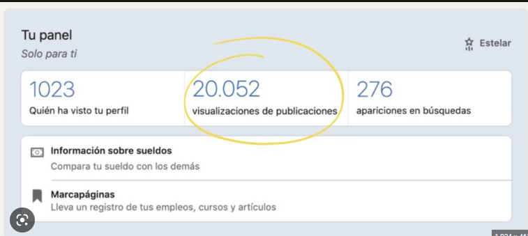
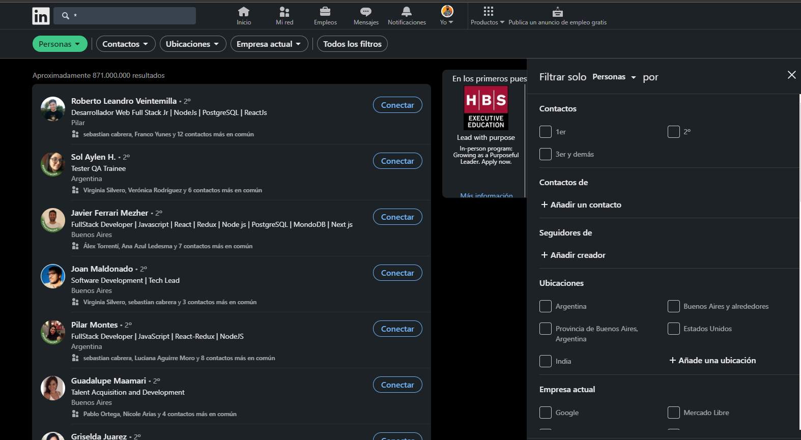
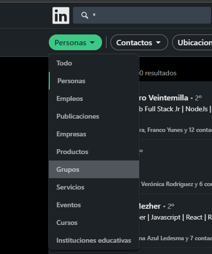
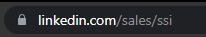
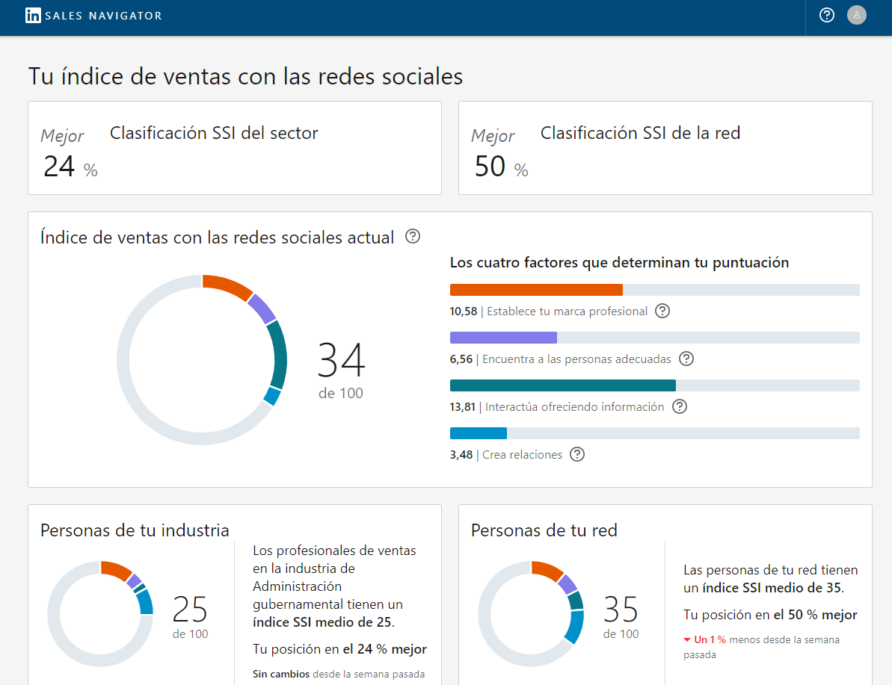
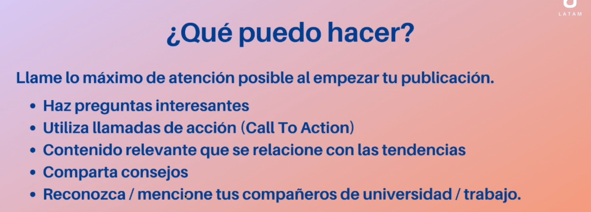

# LinkedIn
## Clases de Alura

### perfil estelar, no se muestra ya el nivel donde el mismo linkedin dice está modificada la sección.
Deberia estar bajo la terjeta del perfil como una insignia sobre, Análisis.

Sí, pero nuestro enfoque principal será en programación. Entonces, sí podemos mencionarlo pero mencionar también que él está cambiando de área y que ahora su enfoque es la programación. Entonces ¿cómo podría estar este resumen?

[03:34] "Empecé mi trayectoria profesional como asistente administrativo. Actualmente, estudio y entrego pequeños proyectos en el área de desarrollo web, para pequeñas y medianas empresas." Entonces podemos ver aquí que él comenta sobre su primer experiencia como auxiliar administrativo, pero también ahora ya está comentando también que está con proyectos en el área de desarrollo web.

Ver de cargar el de UTN 
en aptitudes empezar a agragar los lenguajes etc para fomentar la busqueda

### dos puntos que pueden hacer que tu perfil se pueda ver más profesional.
* url
* idiomas

Cambié la url.

Opción de añadir perfil en otro idioma Mucho trabajo Hacerlo con tiempo y lanzar todo junto.

Vamos a ver los puntos importantes que hemos aprendido en esta clase.

Título: Independientemente si ya tienes tu perfil o si lo creaste ahora, revisa el título de tu perfil y verifica si realmente representa tu principal interés en Linkedin.

Por ejemplo, si eres desarrollador, coloca “Desarrollador + Lenguaje + Junior/Mid/Senior”, ya que puede incrementar tu chance de aparecer en las búsquedas.

Acerca de: Vimos que en la parte "Acerca de" es considerado como el punto principal de tu perfil, o sea, es el momento donde podemos atraer la atención de las personas al decir quienes somos, lo que sabemos, lo que buscamos y lo que podemos ofrecer.

Pensando en eso, puedes actualizar tu perfil ahora.

Si estás empezando en tu jornada laboral y necesitas inspiración, completa los espacios con tu información. Recuerda cambiar el texto de acuerdo con tus conocimientos. Esto apenas es el primer paso. Después puedes actualizar tu Acerca de siempre que te parezca importante.

Estudiante de __, busco oportunidad para adquirir experiencia en (con)____, ___, ___, ___ y ___.

Me agrada trabajar en equipo, cooperando con todos y ayudando de la mejor manera posible, con gran satisfacción en enseñar y aprender.

Busco oportunidades para hacer prácticas en el área de _________, que permita mi crecimiento intelectual y a desarrollar mis conocimientos técnicos, para crecer junto a la empresa y a mis compañeros de trabajo.

Foto de perfil: ¿Tu foto de perfil transmite el profesionalismo que buscas?

Utiliza este momento para pensar en tu foto. Si no puedes tomar una nueva foto ahora, puedes organizarte, pide ayuda a un amigo o amiga para tomar una buena foto tuya siguiendo las buenas prácticas que hemos visto :)

Foto de capa: Si necesitas referencias de páginas para buscar imágenes gratuitas y de buena calidad puedes revisar las siguientes opciones:

Free images;
Pixabay;
FreePik;
Morguefile;
Informaciones Profesionales: Ahora puedes insertar tus experiencias profesionales en tu perfil de LinkedIn.

Recuerda agregar puntos que expliquen las tareas diarias en tu puesto. Si tienes links o archivos que destaquen en tu trabajo puedes insertarlos ahora mismo.

https://blog.hubspot.es/sales/escribir-recomendaciones-linkedin (pedir recomendación)

### contactos

Entonces por ejemplo voy a agregar una persona que se llama Ana. Hola Ana. ¿Cómo estás? Vi tu perfil. Vi que eres programadora, yo estoy empezando a estudiar programación también. Te agrego porque siento que puede ser importante nuestra conexión. Algo así, de forma clara y objetiva.

[03:27] Pero es muy importante que no intentes vender nada en el primer contacto. Entonces agregar una persona, ya diciendo: "mira, nuestra empresa está desarrollando un producto perfecto para tu empresa que te cambiará la vida." Puede ser el mejor producto pero no empieces el contacto intentando vender o diciendo, vamos a suponer que agregas a un reclutador o una persona que es gerente de una empresa donde quieres mucho trabajar.

[03:55] Y dices: "Ay mira, estoy desempleado hace no sé cuánto tiempo. Por favor dame una chance de trabajar en tu empresa". No es una buena práctica. Entonces al agregar a una persona sí puedes presentarte, pero sin intentar vender nada de primera vez.

[04:08] Y si una persona te agregó, pero no te envió ningún mensaje, pues tú puedes ser la persona que haga el primer contacto con esa persona. Entonces si ella te agregó, tú puedes aceptarla y contestarle escribiendo. "Hola". Vamos a suponer que Ana me ha agregado. "Hola Ana, muchas gracias por tu invitación, te hago saber que ya eres parte de mi red de conexiones en LinkedIn".

[04:36] Algo así, pero preséntate. Puedes ser tú la persona que envíes el primer contacto, el primer mensaje a esta persona que te ha agregado. Otro punto que es muy importante es cantidad versus calidad. No es bueno como tener millones y millones de personas, pero que no traigan calidad, que no sean personas que realmente hagan con que tu perfil sea un perfil de buena calidad.

En búsqueda luego de buscar `*` y usando los filtros puedo empezar a buscar contactos de las empresas que me interesan

grupos

### Es buena practica seguir personas o empresas para saber si me interesa y suma como contacto.

### pulse
El pulse es como si fuera una plataforma dentro de LinkedIn, donde te permite crear y subir tus artículos.
Entonces todo se basa en la planificación. Es una plataforma que nos ayuda muchísimo, pero como todo, es necesario planificar. Primero, tienes que definir tu estrategia, porque ahí vas a lograr tener más visibilidad profesional, va a fortalecer tu autoridad en el área y tú vas a compartir tus aprendizajes.

Tienes que definirlo bien, planificarlo, y tienes que tener un calendario editorial porque es necesario tener frecuencia. De nada te sirve que una semana subas un artículo todos los días y después estés un mes sin subir tanto, y después subas otra vez siete días a la semana y después ya no lo subas.

### extra 
https://www.aluracursos.com/blog/5-formas-de-ayudarte-a-crear-mejores-habitos

## SSI
desde mi perfil borro todo hasta .com y escribo /sales/ssi

1. establece tu marca profesional
2. Encuentra las personas adecuadas
3. compartir contenido relevante (periodico planificado)
4. establecer relaciones. (interactuar con tomadores de decisions)

## Contenido

 Tenemos que crear publicaciones que llamen la atención de alguna manera. Porque una vez que llamemos la atención, 
 nosotros vamos a generar curiosidad de las personas. Entonces, ellas van a parar en nuestra publicación para leer, 
 para ver la imagen, para ver el video y así nosotros vamos a ganar destaque, vamos a destacarnos dentro de nuestra red.
 
**Sin enlaces hacia fuera de linkedin**

https://www.aluracursos.com/blog/la-carrera-de-programado-que-curso-tomar-primero
(Ejemplo de contenido)

¿Vamos a entrenar la creación de contenido?

Elige un tema pertinente a tu segmento y publica un pequeño artículo. Busca explorar los tips de:

* Haz preguntas interesantes;
* Utiliza llamadas de acción (Call to Action);
* Contenido relevante que se relacione con las tendencias;
* Reconoce / menciona tus compañeros de universidad / trabajo.

